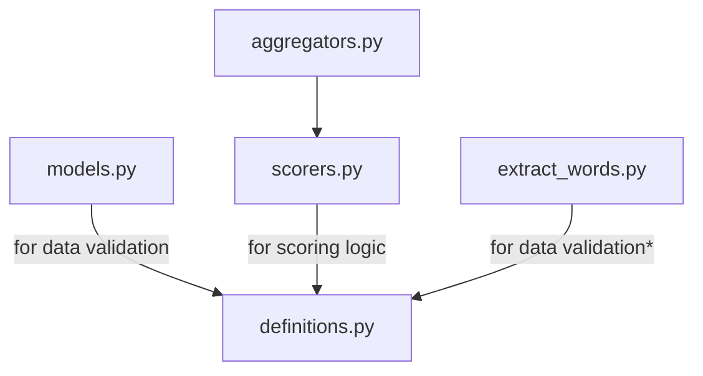

# Decodability

Lightweight scaffolding for language-specific decodability tooling.

## Architecture

This package intentionally keeps the shared interface small. Each language can implement
its own tokenization, student-knowledge representation, and internal scoring logic.

The package splits into two layers: a small, language-agnostic **core** and one
**subpackage per language**.

### Shared core

`annotate.py` holds everything that is reusable across languages and knows nothing about
any specific language's rules:

- `annotate_words(...)`: the main entry point. Scores each word with every scoring
  method, then applies each aggregation, returning the dataframe described above.
- DataFrame-level aggregators with call signature `pd.DataFrame -> pd.Series`, which can
  be
  - generic vectorized aggregations (`mean_score`, `weighted_average`), or
  - custom, via `rowwise(row_func)`, where `row_func` is the
    language/curriculum-specific row-wise aggregation function over various scores.

### Per-language subpackage

Language-specific modules go under `decodability/<language>/`.

| Module             | Responsibility                                                                                                          |
| ------------------ | ----------------------------------------------------------------------------------------------------------------------- |
| `definitions.py`   | Language constants and any external decoding-tool setup                                                                 |
| `models.py`        | The student-knowledge pydantic model                                                                                    |
| `scorers.py`       | Per-word scoring functions mapping `(word, student_knowledge)` to a score in range [0.0, 1.0]                           |
| `aggregators.py`   | Functions that combine a word's per-measure scores into one final score.                                                |
| `extract_words.py` | Language-specific word extractor.                                                                                       |
| `__init__.py`      | Exposes the `SCORING_METHODS` and `AGGREGATIONS` registries (see [Config Shape](#config-shape)) and the public exports. |

The dependency structure is as follows:



_\*This linkage currently doesn't exist for Kiswahili but theoretically we may use a
language-wide config to extract valid tokens._

## Kiswahili Scoring

Kiswahili decodability follows Kenya's Tusome curriculum as well as expert-validated,
binary definition of decodability. Three binary scorers feed the final score:

| Scorer                                        | Returns 1.0 when                                                                                                                                    |
| --------------------------------------------- | --------------------------------------------------------------------------------------------------------------------------------------------------- |
| `score_known_graphemes_kiswahili`             | every grapheme in the word has been taught                                                                                                          |
| `score_known_clusters_and_patterns_kiswahili` | every cluster in the word is known, directly or by pattern, or if the word contains no consonant clusters (no cluster knowledge required to decode) |
| `score_whole_words_kiswahili`                 | the word has been taught as a sight word                                                                                                            |

`aggregate_scores_kenya_tusome` combines them as a decision tree: a known sight word is
decodable regardless of anything else; otherwise an untaught grapheme _or_ an unknown
cluster makes the word non-decodable.

All three scorers must be listed in `scoring_methods`.

### Student knowledge

`KiswahiliStudentKnowledge` is defined by the following fields. We do not consider
uppercase letters as separate graphemes, so we enforce all lowercase for the fields.

- `graphemes`: taught graphemes, validated against the Kiswahili grapheme inventory.
- `clusters`: individually taught clusters, for example `"st"` or `"mbw"`. Every
  grapheme inside a listed cluster must also appear in `graphemes`.
- `cluster_patterns`: `ClusterPattern` codes such as `"prenasalised"` or
  `"labialised_glide"`, each standing for a whole family of clusters (see
  `VALID_CLUSTERS` in `definitions.py`). A cluster already covered by a taught pattern
  must not be repeated in `clusters`.
- `whole_words`: sight words.

## Kiswahili Example

There is a runnable example at `packages/decodability/examples/kiswahili_example.py`. It
uses decodability scoring based on Kenya's Tusome curriculum.

Run it from the repository root:

```bash
uv run --frozen --package decodability python \
  packages/decodability/examples/kiswahili_example.py
```

## Config Shape

The runtime API expects Python callables. Config loading should be a thin layer that
translates stable config names into those callables.

Every scorer named in `scoring_methods` becomes a score column, so a `weighted_average`
aggregation needs a weight for each of them.

Example JSON-like config:

```json
{
  "language": "kiswahili",
  "scoring_methods": [
    "score_known_graphemes_kiswahili",
    "score_known_clusters_and_patterns_kiswahili",
    "score_whole_words_kiswahili"
  ],
  "aggregations": {
    "kenya_tusome_score": {
      "name": "kiswahili_kenya_tusome_aggregator"
    },
    "mean_score": {
      "name": "mean_score"
    },
    "weighted_score": {
      "name": "weighted_average",
      "params": {
        "weights": {
          "score_known_graphemes_kiswahili": 0.5,
          "score_known_clusters_and_patterns_kiswahili": 0.2,
          "score_whole_words_kiswahili": 0.3
        }
      }
    }
  }
}
```
